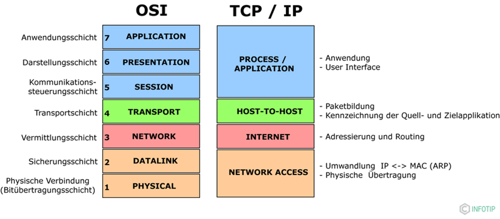
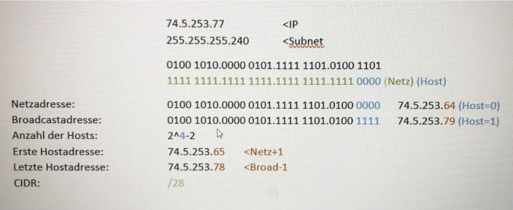
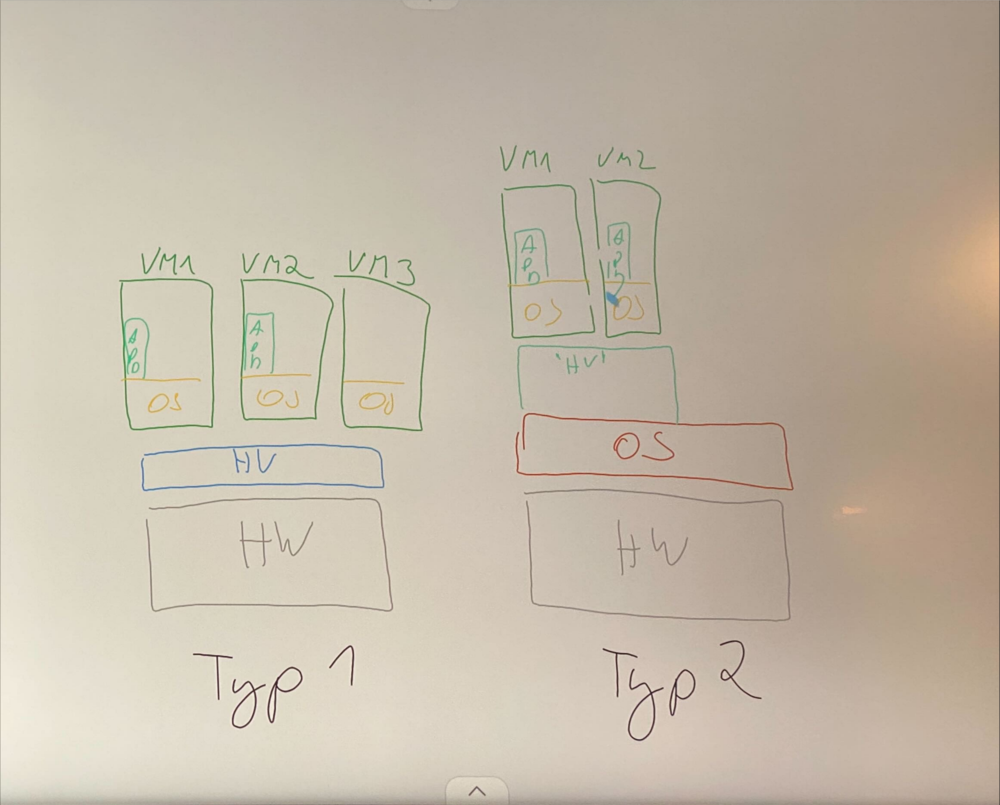

## DORA - Prinzip
D - Discover
O - Offer
R - Request
A - Acknowledge

Port 67, 68

In der Netzwerktechnik bezieht sich DORA normalerweise auf einen Prozess im DHCP (Dynamic Host Configuration Protocol). DHCP ist ein Protokoll, das die automatische Zuweisung von IP-Adressen und anderen Netzwerkkonfigurationen an Geräte in einem Netzwerk ermöglicht.

- Discover (Entdecken): 
    - Ein Gerät, das sich mit dem Netzwerk verbinden möchte und eine IP-Adresse benötigt, sendet ein DHCP-Discover-Paket an das Netzwerk. Dieses Paket fragt nach verfügbaren DHCP-Servern.

- Offer (Angebot): 
    - Die DHCP-Server im Netzwerk empfangen das Discover-Paket und antworten mit einem DHCP-Offer. Dieses Angebot beinhaltet eine IP-Adresse und andere Netzwerkkonfigurationen, die dem anfragenden Gerät zugewiesen werden können.

- Request (Anfrage): 
    - Nachdem das anfragende Gerät ein DHCP-Offer erhalten hat, wählt es eine der angebotenen IP-Adressen aus und sendet eine DHCP-Request-Nachricht an den ausgewählten Server. Dies ist eine formelle Anfrage, die besagt, dass das Gerät die angebotene Konfiguration akzeptiert.

- Acknowledge (Anerkennen): 
    - Der DHCP-Server erhält die DHCP-Request-Nachricht und bestätigt die Zuweisung der angefragten IP-Adresse und Konfiguration, indem er eine DHCP-Acknowledgement-Nachricht zurücksendet. Dadurch akzeptiert das Gerät offiziell die zugewiesene Netzwerkkonfiguration.

DORA beschreibt also den Prozess der IP-Adresszuweisung durch den DHCP-Server an ein Gerät, das sich mit einem Netzwerk verbinden möchte.

## UNC (Uniform Naming Convention)
//`Servername oder IP-Adresse` \ `Ordner-Name`

### Sonstiges
- PAN - 
- Netzwerk
  - Netzwerkkarte 
- Bluetooth baut gleich ein netzwerk auf
- Betriebssysteme sind in c# und .net geschrieben
- Alles was über 100 Meter Kabel hat, sendet kein Signal mehr
- Wlan auf Router auf 5 GigaHertz einstellen
- StandardGateWay = Router
  - Erste ip adresse in einem Subnetz bekommt immer der Router bzw der StandardGateWay
  - Ein Router hat immer 3 Netzwerkkarten
    - Eine Öffentliche IP
    - Eine Pirvate IP
    - Und die IP vom Router selbst

IP für Netzwerk : 192.168.0.0/24 => Netzwerkadresse, kann nicht an den Client übergeben
- Netzwerkadresse ist immer die erste (mit 0 zum schluss)
- Broadcast adresse ist immer die Letzte (zb. 255)
- Maximaler wert 255    
  - 192.168.300.255 => ungültige IP adresse!
- Für 10 Clients welche Subnetzwerkmaste muss verwendet werden
  - 3 Switches, 10 Clients, 10 ip-Adressen
  - Default Gateway braucht keine IP adresse
  - Welche Subnetzwerkmaske
    - 192.168.0.0/28
      - 11111111.11111111.11111111.11110000
      - 2^4 - 2 = 14 
        - Für 14 clients platz
      - (ip 192.168.0.1)
      - (sub 255.255.255.240)
    - Uplink = ein Switch ist mit einem anderem Verbunden (1 Gib/s)
    - Broadcast-ip-Adresse = wird an alle gesendet
    - NAT - Switch zwischen Privater-IP adresse und Öffentlicher Ip Adresse

## Multi-Layer-Switch:
- Kennt Ip Adressen
- Kann ip Logik implementieren
- Kann mit ip adressen arbeiten
- Kann wie ein Router arbeiten

## ARP:
- Adress resoluton protokoll
- Rechner hat ip von allen anderen geräten, aber nicht die mac adresse
- Reiner Informationsaustausch
- Rechner sendet request zu einam anderen um die mac-adresse zu erfahren
- Mein rechner sendet eine broadcast nachricht die alle aus dem netzwerk anspricht, alle rechner machen den request auf und die ip adresse die damit angesprochen wird sendet die Mac-adresse zurück!

## Internetprotokoll-Familien:
- TCP ip
  - Nimmt mehr ressourcen in anspruch
  - Muss sicher gehen das tatsächlich zugesendet wurde
- UDP
  - Zb für Livestreaming
  - So schnell wie möglich mit einem leichten Paket senden
  - ○ Ich sende etwas und mir ist egal ob es ankommt
- IPE
- Iso osi 7 Schichten Model (?)
  - Layer 8 problem ist ein Menschlicher fehler
  - OSI - Open system interconnection
    - Alles was standardisiert ist und wir nicht aktiv merken
    - Wir arbeiten damit jeden tag aber nehmen es nicht wahr!
    

Broadcast in ipv6 gibt es nicht!
Multicast:
- Immer wenn ich eine Nachricht an eine bestimmte gruppe senden möchte, hat diese gruppe eine multicast-adresse (die ich nicht sehe, aber hinterlegt ist). Alle die diese Adresse haben sehen meine Nachricht, alle die die Adresse nicht haben, bekommen die Nachricht nicht!
		
		
Subnetting:
- Jede ip adreese bestesht aus einem host anteil und einem netzanteil
- Netzanteil
  - Gibt die reine netzadresse an vom netzwerk
- Host 
  - Der wie vielte host ist aman in der adresse
  - Verfügbare ip adreesen die ich im netzwerk aufteilen kann
  - Der veränderbare teil der hosts die ich vergeben kann

|                 |                         |
| :-------------- | ----------------------: |
| 192.168.10.6/24 |                         |
| 24              | Bitanzahl des Netzteils |
| 6               |     Adresse eines Hosts |
| 192.168.10.0    |             Netzadresse |
| 255.255.255.0   |         Netzwerkadresse |

  - Vom hostanteil ein paar bits mehr wegnehmen um mehr netzwerke zu bauen

  - 255 ist reserviert für die broadcast adresse!
  - 0 ist reserviert für das netzwerk
  - 254 hosts sind zum vergeben

## RFC - Ip-adressen-standards
- Privatter Adressbereich / Lan (Local Area Netzwork)
  - 192.168.0.0
  - 172.16.0.0
  - 10.0.0.0

## Virtualisierung
Was wird unter Virtualiserung, Emulierung, Sandboxing, Containering und Clustering verstanden?

- Virtualisierung
  - Virtualisierung nutzt Software, um Hardware zu simulieren und Virtuelle Computersysteme zu erstellen. Auf diese Weise können IT-Organisationen mehrere virtuelle Systeme, Betriebssysteme und Anwendungen auf einem einzigen Server ausführen
  - Es wird die Hardware, Software technisch dargestellt
- Emulierung
  - Ein Emulator ist ein Hardware-Gerät oder ein Programm, dass so tut als ob es ein anderes bestimmtes Gerät wäre, mit dem andere Komponenten interagieren sollen
    - Sind Programme, die einen Computer oder ein Betriebssystem nachbilden können und es so ermöglichen Software mit einer anderen Architektur zu verwenden
  - Ist ein BlackboxSystem
    - Software muss nachgebildet werden
    - Man braucht viel mehr code weil alles getestet werden muss, was wieder mehr Ressourcen braucht
- Sandboxing
  - Ist eine isolierte Virtuelle Maschine in der potenziell unsicherer Software Code ausgeführt werden kann ohne Netzwerkressourcen oder lokale Anwendungen zu beeinträchtigen.
  - Applikation wird abgekapselt von allen anderen ausgeführt ohne das was passiert
  - Auch FireFox ist eine Sandbox
    - Intern im Programm kann allerdings schon kommuniziert werden
- Containering
  - Hardware -> Operation System -> Anwendungssoftware (zb Firefox) -> Programmiersprache
- Clustering
  - Verbindet/kombiniert mehrere Computer oder Server zu einer Einheit. Das geschieht über ein Netzwerk in dem die einzelnen Rechner verbunden werden.
  - "Biowolf" ist das System das dafür meistens verwendet werden

Welche Arten/Typen von Virtualisierung gibt es?

- Hardware Virtualisierung
- Software Virtualisierung
- Speicher Virtualisierung
- Daten Virtualisierung
- Netzwerk Virtualisierun
- Anwendung Virtualisierung
- Server Virtualisierung
	

- Typ1 Virtualisierung
  - Hardware
    - Auf der Hardware läuft der Hypervisor ( managet die Verteilung der Hardware Ressourcen)
      - Installierung VMs
        - Betriebssysteme
          - Applikationen / Anwendungssoftware
  - ○ Hypervisor muss mit der Hardware kommunizieren der muss die Hardware kennen
    - Ich kann nur Hardware verwenden die der Hypervisor kennt
    - Ich kann eventuell nicht die neueste Hardware verwenden
- Typ 2 Virtualisierung
  - Hardware
    - Betriebssysteme
      - Hypervisor
        - VMs
          - Betriebssysteme
            - Anwendungssysteme
  - Ist langsamer weil ein zusätzliches Betriebssystem dazwischen geschalten ist
  - Bessere Hardware Kompatibilität -> ich kann die neueste Hardware verwenden
		

Welche Vor- und Nachteile hat die Virtualisierung allgemein?

- Vorteile:
  - Geringe Investition und Betriebskosten
  - Keine oder nur geringe Ausfallzeit
  - Verbesserte Produktivität, Effizienz, Agilität und Reaktionsfähigkeit in der IT
  - Schnelle Anwendungs- und Ressourcen Bereitstellung
- Nachteile
  - Ausfall aller Virtual Maschine bei Ausfall des Wirtsystems ergibt ein erhöhtes Risiko
  - Ungenaue Zeitscheiben
  - Höhere Latenzen mit mehreren Virtual Mashines pro System

Welche Vor und Nachteile haben die 2 Arten der Virtualisierung?

- Hardware Virtualisierung
  - Vorteile
    - Hardware-Ressourcen können dynamisch zugeteilt und effizienter ausgenutzt werden
    - Hardware lässt sich energieeffizienter betreiben als separate Rechner
    - Virtual Mashines bieten hohen Isolationsgrad und damit Sicherheit
  - Nachteile
    - Die Performance einer Virtual Mashine kann durch andere beeinträchtigt werden
- Software Virtualiseriung
  - Vorteile
    - Anwendung kann zentral bereit gestellt werden
    - Schutz vor Schadhaften Code
    - Software lässt sich rückstandslos vom gerät entfernen
  - Nachteile
    - Lizensierung

Welche Firmen/Produkte gibt es auf dem Virtualisierungsmarkt?

- VMWare -> ESXi/Workstation (Typ1 Virtualisierung) 
  - ESXi - Läuft auch von einem USB-Stick aus
- Microsoft -> Hyper-V
  - Ist bei windows10 inkludiert
  - Ist gratis
- Oracle -> VirtualBox
  - Ist gratis
  - Super zum Testen aber nicht für den Professionellen gebrauch tauglich
- Citrix -> Xen
  - Konkurrenz zu ESXi
  - Stabiler aber keine ordentliche Oberfläche
  - Ist für Großrechnern gedacht wo mit Skripten gearbeitet werden
  - Kommandozeilen lastig
- KVM
- Qemu
- Proxmox
  - Typ1 Virtualisierung

