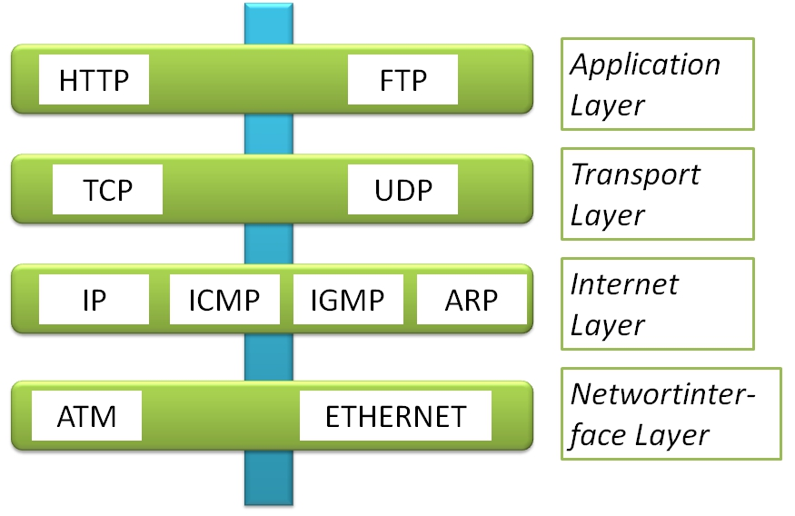

% Lernblatt Netzwerkprotokolle und Ports

# Netzwerkprotokolle

Ein Netzwerkprotokoll ist ein Satz von Regeln, der den Datenaustausch zwischen zwei oder mehr Computern über ein Netzwerk ermöglicht. Netzwerkprotokolle legen fest, wie Daten verpackt, gesendet und empfangen werden, sowie wie Fehler erkannt und korrigiert werden.

# Wichtige Netzwerkprotokolle

Zu den wichtigsten Netzwerkprotokollen gehören:

- `IP (Internet Protocol)`: 
  - IP ist das grundlegende Protokoll für das Internet. Es legt fest, wie Datenpakete über das Internet versendet werden.

- ` TCP (Transmission Control Protocol)`: 
  - TCP ist ein Protokoll, das eine verbindungsorientierte Kommunikation zwischen zwei Computern ermöglicht. Es stellt sicher, dass die Daten in der richtigen Reihenfolge und ohne Fehler gesendet und empfangen werden.

- ` UDP (User Datagram Protocol)`: 
  - UDP ist ein Protokoll, das eine verbindungslose Kommunikation zwischen zwei Computern ermöglicht. Es ist schneller als TCP, aber nicht so zuverlässig.

- ` HTTP (Hypertext Transfer Protocol)`: 
  - HTTP ist das Protokoll, das für die Übertragung von Webseiten im Internet verwendet wird. Es legt fest, wie Webseiten angefordert und empfangen werden.
- `DNS (Domain Name System)`: 
  - DNS ist ein Protokoll, das IP-Adressen in Domainnamen übersetzt. Es ermöglicht es uns, Webseiten über ihre Domainnamen (z. B. www.google.com) aufzurufen, anstatt über ihre IP-Adressen (z. B. 172.217.0.100).

# Ports

Ein Port ist eine numerische Adresse, die einem Netzwerkdienst zugeordnet ist. Ports werden verwendet, um verschiedene Netzwerkdienste zu unterscheiden. Beispielsweise wird der Port 80 für HTTP verwendet, der Port 25 für SMTP und der Port 443 für HTTPS.

## Wichtige Ports

Zu den wichtigsten Ports gehören:

- Port 80: HTTP
- Port 25: SMTP
- Port 443: HTTPS
- Port 22: SSH
- Port 21: FTP
- Port 143: IMAP
- Port 53: DNS
- Port 67: DHCP Server
- Port 68: DHCP Clients
- Port 137: NetBIOS Name Service
- Port 138: NetBIOS Datagram Service
- Port 139: NetBIOS Session Service

# Fazit

Netzwerkprotokolle und Ports sind für die Kommunikation zwischen Computern über ein Netzwerk unerlässlich. Durch die Kenntnis der wichtigsten Netzwerkprotokolle und Ports können Sie Ihre Netzwerkkenntnisse verbessern und Ihre Netzwerksicherheit erhöhen.