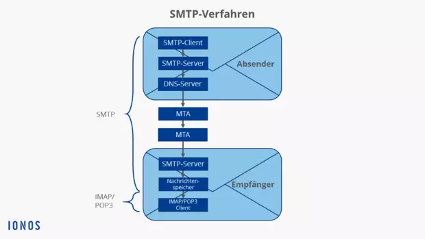
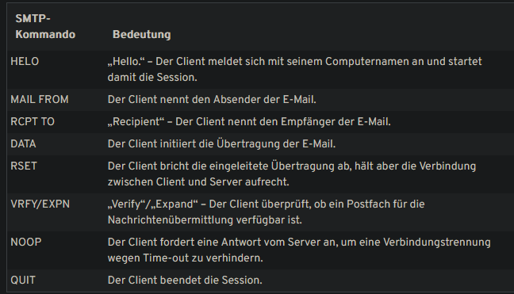
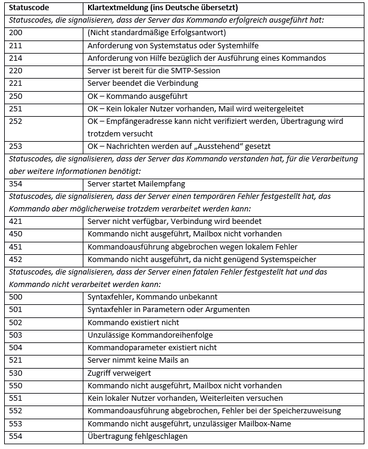
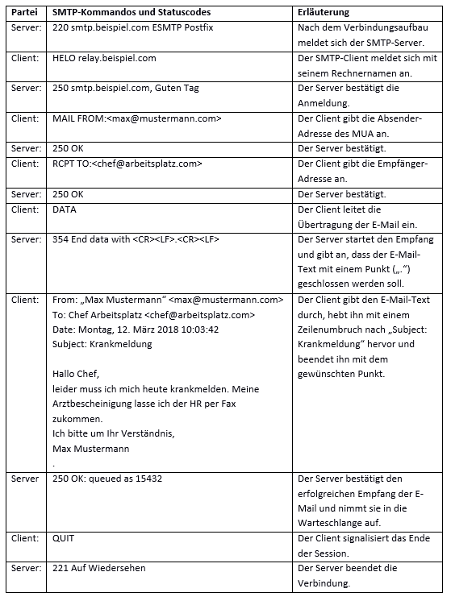
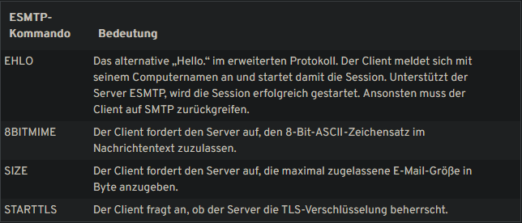

# SMTP - Simple Mail Transfer Protocol

- Ist ein Protokoll das für das Senden von E-Mails zuständig ist. Für das Empfangen wird allerdings POP3 oder IMAP gebraucht!
<!-- - Auf UNIX-basierten Systemen werden meist sendmail und postfix als SMTP-Server für E-Mails eingesetzt. -->
- Basiert auf TCP/IP und Port 25
- Ist ein verbindungsorientiertes, textbasiertes Netzwerkprotokoll aus der Internetprotokollfamilie und ist als solches auf der siebten Schicht des OSI-Modells, der Anwendungsschicht, angesiedelt.
- Als Nachfolger vom Arpanet ist SMTP zum Standardprotokoll für den Versand von Emails geworden.
  - Arbeitet im jeweiligen Webmail-Anwendungen m Hintergrund

# Wie funktioniert das SMTP-Verfahren?

1. Der SMTP-Client, also der Absender, lädt die E-Mail auf den SMTP-Server, also den E-Mail-Server (Postausgangsserver) des jeweiligen E-Mail-Providers. Dies geschieht über eine Webmail-Anwendung im Browser oder ein E-Mail-Programm (technisch „Mail User Agent“, kurz MUA, genannt) wie Windows Live Mail oder Mozilla Thunderbird.
2. Der SMTP-Server kontaktiert daraufhin den DNS-Server, und dieser sucht die IP-Adresse des Ziel-SMTP-Servers (auch „Mail Delivery Agent“, kurz MDA) heraus, die für die Empfängeradresse der E-Mail hinterlegt ist.
3. Der SMTP-Server schickt die E-Mail über einen oder mehrere „Mail Transfer Agents“ (MTA) zum Ziel-SMTP-Server. Jeder dieser Weiterleitungsvorgänge läuft dabei nach dem SMTP-Protokoll ab.
4. Der Ziel-SMTP-Server speichert die E-Mail temporär im Nachrichtenspeicher.
5. Der Empfänger-MUA lädt die E-Mail entweder per IMAP oder POP3 herunter.

# SMTP-Session

- In der SMTP-Session interagieren SMTP-Client und SMTP-Server.
- Der Rest des Verfahrens, wie die E-Mail-Weiterleitung, wird später behandelt.
- Die Session beinhaltet SMTP-Kommandos vom Client und Statuscodes vom Server.

Auf jedes dieser SMTP-Kommandos des Clients antwortet der Server mit einem dreistelligen Statuscode inklusive Klartextmeldung.

Eine SMTP-Session zwischen Client und Server kann beispielsweise wie folgt ablaufen:

# Was sind Nachteile des SMTP-Protokolls? 
- Fehlende verwertbare Versandbestätigung.
- Fehlende Authentifizierung beim Verbindungsaufbau.
- Fehlgeschlagene Übertragungen erschweren Fehleranalyse.
- Offene SMTP-Relays werden für Spam missbraucht.
- Fake-Absenderadressen (Mail-Spoofing) erschweren die Rückverfolgung.
- Sicherheitstechniken wie DomainKeys, SPF und Greylisting sind im Einsatz.
- Port 587/TCP wird für authentifizierte Übertragungen genutzt.

# SMTPS
- smtpS ist smtp mit ssl oder tls als verschlüsselung

# Was ist ESMTP?
Als Reaktion auf das grassierende Spam-Problem im Internet wurde im Jahr 1995 eine Erweiterung des SMTP herausgebracht: Extended SMTP (kurz ESMTP). Es ergänzt das Protokoll um weitere Kommandos im 8-Bit-ASCII-Code, mit denen viele neue Funktionen zur Einsparung von Bandbreite und zum Schutz von Servern möglich wurden.

- Authentifizierung des Absenders
- SSL-Verschlüsselungen von E-Mails
- Anhängen von Multimedia-Dateien an E-Mails
- Größenbeschränkungen von E-Mails gemäß Server-Vorgaben
- Gleichzeitiger Versand an mehrere Empfänger
- Standardisierte Fehlermeldungen bei Unzustellbarkeit

