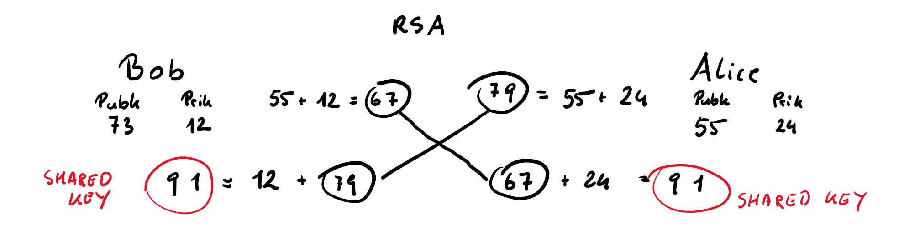

# PSK
- PreSharedKey
- Jeder der das passwort kennt hat nachteile

# AES
- Advaneced Encript Standard
- Wie wird es verschlüsselt
- ist sicherer
- ist symetrisch

Klartext -> Ciffertext -> Klartext
(ABBA -> DEED -> ABBA)

Durch verschlüsselung wird es scherer zurm rückführen

# https
- Vorteile
  - Schlüsseltausch-Problem
  - mit dem asymetrischen verschlüsseln kann man einen schlüssel übertragen ohne das ein dritter es mitbekommt
  - es wird nicht der originalschlüssel versendet
  - wenn der gemeinsame schlüssel übertragen wird, ist nicht die gesammte kommunikation asymetrisch sondern nur der schlüssel

# asymetrisches verfahren
- es wird ein schlüsselpaar generiert
  - private key
  - public key

# symetrisches verfahren

# RSA
Versendungsalgorithmus mit dem man **asymentrische verschlüsselung** gewährleistet werden
- Standard das beinahe überall verwendet wird
- jede webside die vewendet wird verwendet rsa
- zb digitale signatur
- mehrfaktoren authentifizierung

- Integrität

es muss ein schlüsselpaar generiert werden (Public key & Private key)

### Public key - Private key Methode

- Shared key ist der symetrische key der für die verschlüsselung verwendet wird
- schlüssel **muss** ident sein um den klartext zu entschlüsseln

# Digitales Zertifikat

# Kryptographie
die wichtigsten eigenschaften um das protokoll darzustellen
## Symetrischer Schlüssel
## Asymetrischer Schlüssel

# Domain
- Verwaltungssystem
- Organisationseinheit für services in einem Netzwerk
  - jeder der das dns servis nutzt gehört zum Domain-System

braucht auch einen Domainen-namen der dann über das DNS erreichbar ist